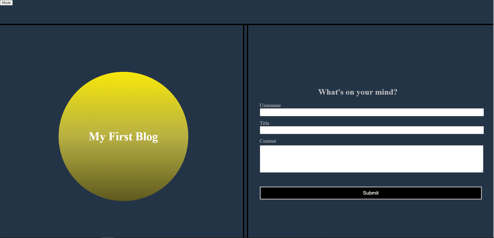
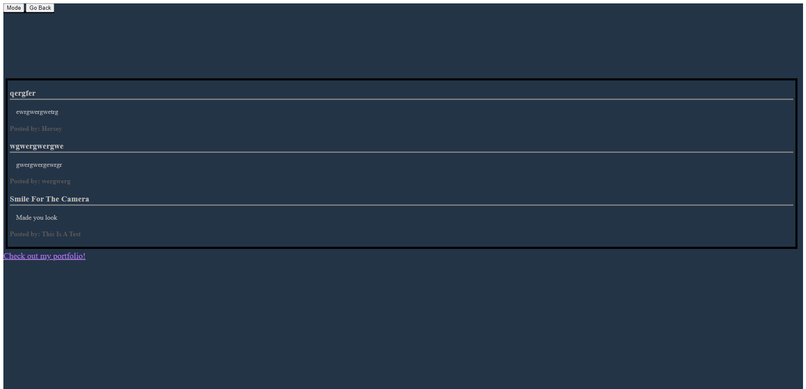

# Employee Payroll-Tracker

Week 3 Challenge - Create a blog site that will dynamically add and post blog content.

## Description

The purpose of this project was to create a blog website that would utilize local storage to dynamically populate blog posts. I created this project to further understand and implement JavaScript in a realistic application. Through this project I have learned the methods of storing and retrieving objects from local storage as well as looping through arrays of objects. I have also gained a higher level of comfort working across all 3 of the languages we have currently used.

## Table of Contents

- [Code Source](#code-source-within-this-repo)
- [Usage](#usage)
- [Credits](#credits)
- [License](#license)

## Code Source Within This Repo

The HTML code within this repo can be found at [./index.html](index.html)and at [./blog.html](blog.html) 

The JavaScript can be found at [./assets/js/form.js](assets/js/form.js) and at [./assets/js/blog.js](assets/js/blog.js)

The CSS can be found at [./assets/css/styles.css](assets/css/styles.css) and at [./assets/css/blog.css](assets/css/blog.css)

## Usage

The live deployment of this project can be found at [https://h-lane.github.io/personal-blog/](https://h-lane.github.io/personal-blog/)

## Credits

- University of Richmond Coding Bootcamp
- README Template provided by [The Coding Bootcamp Github](https://coding-boot-camp.github.io/full-stack/github/professional-readme-guide)
- HTML Assistance provided by [The Coding Bootcamp Github](https://coding-boot-camp.github.io/full-stack/html/html-cheatsheet)
- Markdown Syntax assistance provided by [Github Docs](https://docs.github.com/en/get-started/writing-on-github/getting-started-with-writing-and-formatting-on-github/basic-writing-and-formatting-syntax#section-links)

## License

This project has no license and is openly available.
